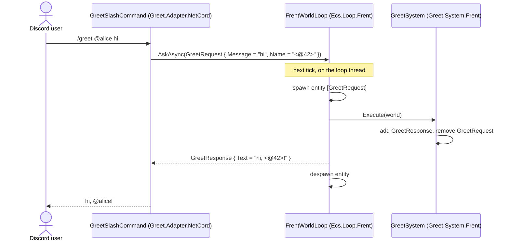

# Project/CS — how a feature works

Everything here runs through **one ECS world**, like a game:

| In a game | Here |
|---|---|
| the world | a Frent `World` |
| the rules | systems: `<Feature>.System.Frent` |
| controllers and screens | adapters: `<Feature>.Adapter.<Tech>` (Discord today; Telegram, MCP, HTTP later) |
| the game loop | `FrentWorldLoop` in `Ecs.Loop.Frent`, ticking 20 times per second |

**The one rule:** the world never knows who is talking to it, and adapters never know what is inside the world. They share only plain data (`<Feature>.Data`).

`Ping` and `Greet` are the reference features for request/response; `Ticket` is the
reference for state that outlives a reply, buttons as inputs, and world-initiated
calls (the Cloudflare classifier). When in doubt, copy `Greet` for simple features and
`Ticket` for stateful ones.

## The life of a request: `/greet user:@alice message:hi`

1. Discord calls the adapter.
2. The adapter turns Discord things into plain data (the `User` becomes the text `<@42>`) and calls `world.AskAsync<GreetRequest, GreetResponse>(…)`. Any thread is fine: this only enqueues.
3. On the next tick the loop spawns an entity holding the `GreetRequest`.
4. The loop runs every system in order. `GreetSystem` adds a `GreetResponse` to that same entity and removes the `GreetRequest`.
5. The loop hands the response to the waiting adapter and despawns the entity.
6. The adapter turns the plain data back into a Discord reply.

## World → adapter events: the ticket asks Cloudflare for a priority

`AskAsync` covers everything an adapter starts. When the **world** must start something
(a slow external call it can't make inside a tick), it emits a notification:

1. The system defines the notification as a plain struct in its `<Feature>.Data`
   (e.g. `PriorityClassifyRequested`) and **adds it as a component** on the entity.
2. The composition root calls `world.AddNotificationDelivery<PriorityClassifyRequested>()`
   once after building the loop: a delivery pass at the end of every tick removes the
   component and publishes it to subscribers.
3. The adapter that can handle it subscribes — `world.Subscribe<PriorityClassifyRequested>(…)`
   — does its platform work (the Cloudflare adapter POSTs to Workers AI clef), and answers
   the world through the normal door: `AskAsync(new PriorityClassified { … })`.

The reply contract stays unchanged: the system finishes the original request only when
the answer arrives (the `/it` request waits behind an `AwaitingClassification`
component until the classifier answers, then the ticket card goes out).

The classifier itself is Cloudflare Workers AI's [clef](https://developers.cloudflare.com/workers-ai/models/clef/)
model — nothing runs locally. It needs `Cloudflare__AccountId`/`Cloudflare__ApiToken`
(the Aspire AppHost wires them from its `cloudflare-account`/`cloudflare-token`
parameters); without them, or when Cloudflare is unreachable, tickets still open —
urgent and marked offline.

## Modules

| Module | Holds | May reference | Must never reference |
|---|---|---|---|
| `<Feature>.Data` | `<Feature>Request`, `<Feature>Response`: plain `partial struct`s with public fields | nothing | anything |
| `<Feature>.System.Frent` | the rule; runs **inside** the tick | its Data, Frent | adapters, platform SDKs, `Ecs.Client` |
| `<Feature>.Adapter.<Tech>` | platform ⇄ plain data; runs **outside** the world | its Data, `Ecs.Client`, the platform SDK | Frent, any System |
| `Ecs.Client` | `IWorldClient`, the only door into the world | nothing | anything |
| `Ecs.Loop.Frent` | `FrentWorldLoop`, the game loop | `Ecs.Client`, Frent | any feature |
| `Bot.Discord` (in `DotNet/`) | the composition root: picks the systems and adapters, runs the loop | everything | — |

Project references enforce this table: a System can't call NetCord because it can't even see it.

## Add a feature `Foo` (copy Greet)

Each module is its own repo under `github.com/YouAnd-I`, added as a submodule under `CS/`, with the same `.gitignore` as the others.

1. **`Foo.Data`**: `FooRequest` (what the adapter knows) and `FooResponse` (what it gets back). No references, no logic, no tests.
2. **`Foo.System.Frent`**: `public static void Execute(World world)`. Query `FooRequest`; for each row, copy `row.Entity` into a local, read the request, add a `FooResponse` to **the same entity**, and remove the `FooRequest`.
3. **`Foo.System.Frent/tests`**: `new World()`, `world.Create(new FooRequest { … })`, `FooSystem.Execute(world)`, then assert on the response. No loop, no adapter.
4. **`Foo.Adapter.NetCord`**: `AddFoo(this IHost host, IWorldClient world)` registers the command. A public `HandleAsync` turns Discord input into a `FooRequest`, awaits `world.AskAsync<FooRequest, FooResponse>(…)` with a 2 s timeout, and turns the `FooResponse` into the reply.
5. **`Foo.Adapter.NetCord/tests`**: a `StubWorld : IWorldClient` that records the request and returns a canned response. No ECS, no Discord connection.
6. **Wire it** in `DotNet/Bot.Discord/src/Program.cs`: add `FooSystem.Execute` to the `FrentWorldLoop` constructor and call `host.AddFoo(world)`. If the feature emits notifications, also call `world.AddNotificationDelivery<FooNotification>()` before the host starts.
7. **Register** every `Foo.*` project in `Project.slnx` and run `dotnet test Project.slnx`.

Stateful features: `TicketSystem` owns a store (the ticket log), so it's an instance —
`new TicketSystem(TicketStore.Default)` — and the composition root passes `tickets.Execute`
to the loop. A system may hold state; adapters still only ever see `IWorldClient`.

## Rules

- **Only systems touch the `World`, and only inside a tick.** Frent's `World` is not thread safe: four threads sharing one crash the process with a segfault.
- **Answer on the request's own entity**, then remove the request. The loop despawns the entity once the response is delivered.
- **Requests are messages, not state.** Anything that must outlive the reply (a ticket, a user) is its own entity; the response carries its id.
- **Translate before data enters the world.** Adapters pass text and numbers, never SDK objects or platform ids: Greet sends the mention text, not the Discord `User`.
- **No platform names in Data or System modules**: `Ping.Data`, not `Discord.Ping.Data`.
- **Requests are components, not Frent tags.** Spawn them with `world.Create(…)` and query them with `Query<T>()`. Frent tags (`entity.Tag<T>()`) live in separate storage, so a component query never finds them.
- **Systems run in the order given to `FrentWorldLoop`.** A system that throws stops the host on purpose: a half-applied tick is worse than a restart.
- **Inside `*.System.*` namespaces, `System` means your feature's namespace.** Write `global::System.X` when you need a fully qualified BCL name there.
- **Don't name a type after its feature namespace.** Inside `Ticket.*` a type named `Ticket` hides the namespace (CS0118) — the ticket's entity component is `TicketRecord`. Same reason `User.Data` must not keep a type named `User` once adapters reference NetCord.
- **Test where the logic is:** systems with a `World`, adapters with a stub `IWorldClient`, the loop with `Tick()`. Plain data gets no tests.

## Not built yet

- Fire-and-forget input and a world clock for time-based systems.
